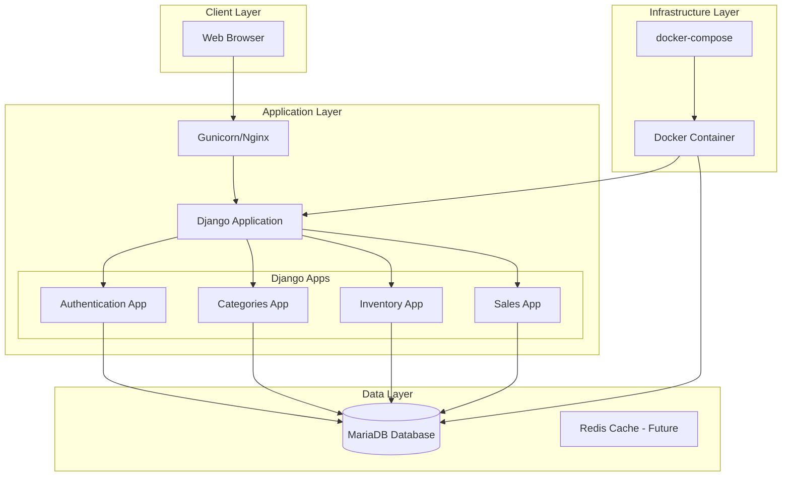
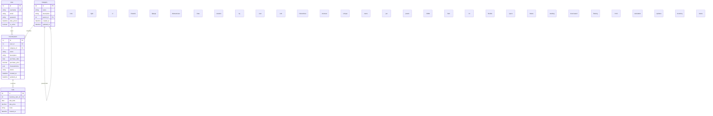

# Design Document: Inventory Management System

## Overview

The Inventory Management System is a Django web application designed for electronics repair businesses to track inventory items, categories, and sales. The system provides a secure, multi-user environment where each user's data is isolated, with features for managing hierarchical categories, storing flexible product specifications in JSON format, and tracking sales with profit calculations.

### Core Architecture Decisions

1. **Framework**: Django 4.x with Django REST Framework for potential API expansion
2. **Database**: MariaDB for production, SQLite for development
3. **Authentication**: Django's built-in authentication with custom user model
4. **Frontend**: Django templates with Bootstrap for responsive design
5. **Deployment**: Docker containerization with docker-compose for multi-service orchestration
6. **Data Isolation**: User-based data segregation at the query level

### Key Design Principles

- **Separation of Concerns**: Clear separation between models, views, templates, and static assets
- **Security First**: CSRF protection, secure password hashing, and user-based data filtering
- **Extensibility**: Modular app structure to allow future feature additions
- **User Experience**: Clean, responsive interface with intuitive navigation

## Architecture

### System Architecture Diagram



### Deployment Architecture

The system uses a two-container Docker setup:
1. **Django Application Container**: Runs Gunicorn WSGI server with the Django application
2. **MariaDB Container**: Database service with persistent volume storage

Future scalability considerations:
- Add Redis container for caching and session storage
- Add Nginx container for static file serving and load balancing
- Implement database replication for high availability

## Components and Interfaces

### Django Application Structure

```
inventory_management/
├── manage.py
├── inventory_management/
│   ├── __init__.py
│   ├── settings.py
│   ├── urls.py
│   ├── wsgi.py
│   └── asgi.py
├── requirements.txt
├── Dockerfile
├── docker-compose.yml
├── .env.example
├── Makefile
├── docs/
├── tests/
├── authentication/
│   ├── __init__.py
│   ├── models.py
│   ├── views.py
│   ├── urls.py
│   ├── forms.py
│   └── templates/
├── categories/
│   ├── __init__.py
│   ├── models.py
│   ├── views.py
│   ├── urls.py
│   ├── forms.py
│   └── templates/
├── inventory/
│   ├── __init__.py
│   ├── models.py
│   ├── views.py
│   ├── urls.py
│   ├── forms.py
│   └── templates/
├── sales/
│   ├── __init__.py
│   ├── models.py
│   ├── views.py
│   ├── urls.py
│   ├── forms.py
│   └── templates/
└── templates/
    ├── base.html
    ├── navigation.html
    └── dashboard.html
```

### Component Descriptions

#### 1. Authentication App
- **Purpose**: Handle user authentication, login, logout, and user profile management
- **Key Features**: Custom user model, login/logout views, password management
- **Interfaces**: Login form, user session management, permission checking

#### 2. Categories App
- **Purpose**: Manage hierarchical category structure for inventory items
- **Key Features**: CRUD operations for categories, hierarchical tree display, validation
- **Interfaces**: Category admin interface, category selection forms

#### 3. Inventory App
- **Purpose**: Core inventory management with JSON characteristics field
- **Key Features**: Inventory item CRUD, JSON field management, user-based filtering
- **Interfaces**: Inventory list/detail views, JSON characteristic forms

#### 4. Sales App
- **Purpose**: Track sales transactions and calculate profit margins
- **Key Features**: Sale recording, profit calculation, inventory status updates
- **Interfaces**: Sale creation form, sales reporting, profit display

### Template Structure

```
templates/
├── base.html                    # Base template with navigation
├── partials/
│   ├── navigation.html          # Navigation menu
│   ├── footer.html              # Footer content
│   └── messages.html            # Django messages display
├── authentication/
│   ├── login.html               # Login page
│   └── logout.html              # Logout confirmation
├── categories/
│   ├── list.html                # Category list view
│   ├── detail.html              # Category detail view
│   ├── form.html                # Category create/edit form
│   └── delete.html              # Category delete confirmation
├── inventory/
│   ├── list.html                # Inventory item list
│   ├── detail.html              # Inventory item detail
│   ├── form.html                # Inventory item create/edit form
│   └── delete.html              # Inventory item delete confirmation
├── sales/
│   ├── list.html                # Sales list view
│   ├── detail.html              # Sale detail view
│   ├── form.html                # Sale creation form
│   └── report.html              # Sales report
└── dashboard.html               # Home dashboard
```

## Data Models

### User Model
```python
# Extends Django's AbstractUser with minimal customization
class User(AbstractUser):
    # Add custom fields if needed in future
    # For now, using AbstractUser as-is with email field
    class Meta:
        db_table = 'auth_user'
```

### Category Model
```python
class Category(models.Model):
    name = models.CharField(max_length=100, unique=False)  # Unique within parent
    description = models.TextField(blank=True)
    parent = models.ForeignKey(
        'self', 
        on_delete=models.CASCADE, 
        null=True, 
        blank=True, 
        related_name='children'
    )
    created_at = models.DateTimeField(auto_now_add=True)
    updated_at = models.DateTimeField(auto_now=True)
    
    class Meta:
        verbose_name_plural = 'categories'
        constraints = [
            models.UniqueConstraint(
                fields=['name', 'parent'],
                name='unique_category_name_per_parent'
            )
        ]
    
    def __str__(self):
        return self.name
    
    def get_ancestors(self):
        """Get all ancestors of this category"""
        ancestors = []
        parent = self.parent
        while parent:
            ancestors.append(parent)
            parent = parent.parent
        return ancestors
    
    def get_descendants(self):
        """Get all descendants of this category"""
        descendants = []
        for child in self.children.all():
            descendants.append(child)
            descendants.extend(child.get_descendants())
        return descendants
```

### InventoryItem Model
```python
class InventoryItem(models.Model):
    STATUS_CHOICES = [
        ('available', 'Available'),
        ('in_repair', 'In Repair'),
        ('sold', 'Sold'),
        ('scrapped', 'Scrapped'),
    ]
    
    user = models.ForeignKey(
        settings.AUTH_USER_MODEL,
        on_delete=models.CASCADE,
        related_name='inventory_items'
    )
    category = models.ForeignKey(
        Category,
        on_delete=models.PROTECT,
        related_name='inventory_items'
    )
    name = models.CharField(max_length=200)
    description = models.TextField(blank=True)
    purchase_date = models.DateField()
    purchase_price = models.DecimalField(max_digits=10, decimal_places=2)
    characteristics = models.JSONField(default=dict, blank=True)
    status = models.CharField(
        max_length=20,
        choices=STATUS_CHOICES,
        default='available'
    )
    created_at = models.DateTimeField(auto_now_add=True)
    updated_at = models.DateTimeField(auto_now=True)
    
    class Meta:
        indexes = [
            models.Index(fields=['user', 'status']),
            models.Index(fields=['user', 'category']),
            models.Index(fields=['user', 'purchase_date']),
        ]
    
    def __str__(self):
        return f"{self.name} ({self.status})"
    
    def is_sold(self):
        return self.status == 'sold'
    
    def get_characteristics_display(self):
        """Convert JSON characteristics to human-readable format"""
        if not self.characteristics:
            return "No characteristics specified"
        
        lines = []
        for key, value in self.characteristics.items():
            if isinstance(value, dict):
                value_str = json.dumps(value, indent=2)
            else:
                value_str = str(value)
            lines.append(f"<strong>{key}:</strong> {value_str}")
        return mark_safe("<br>".join(lines))
```

### Sale Model
```python
class Sale(models.Model):
    inventory_item = models.ForeignKey(
        InventoryItem,
        on_delete=models.PROTECT,
        related_name='sales'
    )
    sale_date = models.DateField()
    sale_price = models.DecimalField(max_digits=10, decimal_places=2)
    notes = models.TextField(blank=True)
    created_at = models.DateTimeField(auto_now_add=True)
    
    class Meta:
        indexes = [
            models.Index(fields=['inventory_item__user', 'sale_date']),
        ]
    
    def __str__(self):
        return f"Sale of {self.inventory_item.name} on {self.sale_date}"
    
    def calculate_profit(self):
        """Calculate profit: sale price - purchase price"""
        return self.sale_price - self.inventory_item.purchase_price
    
    def calculate_profit_margin(self):
        """Calculate profit margin as percentage"""
        purchase_price = self.inventory_item.purchase_price
        if purchase_price == 0:
            return Decimal('100.00')  # Avoid division by zero
        profit = self.calculate_profit()
        return (profit / purchase_price) * 100
    
    def save(self, *args, **kwargs):
        """Override save to update inventory item status"""
        is_new = self.pk is None
        super().save(*args, **kwargs)
        
        if is_new:
            # Update the inventory item status to sold
            self.inventory_item.status = 'sold'
            self.inventory_item.save(update_fields=['status', 'updated_at'])
```

### Database Schema Diagram



### JSON Characteristics Field Design

The `characteristics` JSON field in `InventoryItem` model supports flexible product specifications:

```python
# Example JSON structures for different categories:

# Phone characteristics
phone_characteristics = {
    "brand": "Samsung",
    "model": "Galaxy S21",
    "storage_gb": 128,
    "ram_gb": 8,
    "color": "Phantom Black",
    "condition": "Good",
    "issues": ["Screen scratch", "Battery degraded"],
    "imei": "123456789012345",
    "network_lock": "Unlocked"
}

# Graphics Card characteristics
gpu_characteristics = {
    "manufacturer": "NVIDIA",
    "model": "RTX 3080",
    "vram_gb": 10,
    "memory_type": "GDDR6X",
    "core_clock_mhz": 1440,
    "boost_clock_mhz": 1710,
    "length_mm": 285,
    "power_connectors": ["8-pin", "8-pin"],
    "condition": "Excellent",
    "test_results": {
        "stress_test_passed": True,
        "max_temperature_c": 78,
        "benchmark_score": 17500
    }
}

# CPU characteristics
cpu_characteristics = {
    "brand": "AMD",
    "model": "Ryzen 7 5800X",
    "cores": 8,
    "threads": 16,
    "base_clock_ghz": 3.8,
    "boost_clock_ghz": 4.7,
    "socket": "AM4",
    "tdp_w": 105,
    "condition": "Like New",
    "test_stability": "24h Prime95 stable"
}
```

### Form Design for JSON Characteristics

Category-specific form templates will be implemented to provide structured input for common characteristics:

```python
# Dynamic form generation based on category
def get_characteristics_form(category):
    """Return a form class with fields based on category"""
    form_fields = {}
    
    if category.name == "Phones":
        form_fields['brand'] = forms.CharField(max_length=50)
        form_fields['model'] = forms.CharField(max_length=50)
        form_fields['storage_gb'] = forms.IntegerField(min_value=1)
        form_fields['ram_gb'] = forms.IntegerField(min_value=1)
        form_fields['color'] = forms.CharField(max_length=30, required=False)
        form_fields['imei'] = forms.CharField(max_length=15)
        
    elif category.name == "Graphics Cards":
        form_fields['manufacturer'] = forms.CharField(max_length=50)
        form_fields['model'] = forms.CharField(max_length=100)
        form_fields['vram_gb'] = forms.IntegerField(min_value=1)
        form_fields['memory_type'] = forms.CharField(max_length=20)
        form_fields['length_mm'] = forms.IntegerField(min_value=100)
        
    # Add more category-specific field definitions
    
    return type('CharacteristicsForm', (forms.Form,), form_fields)
```