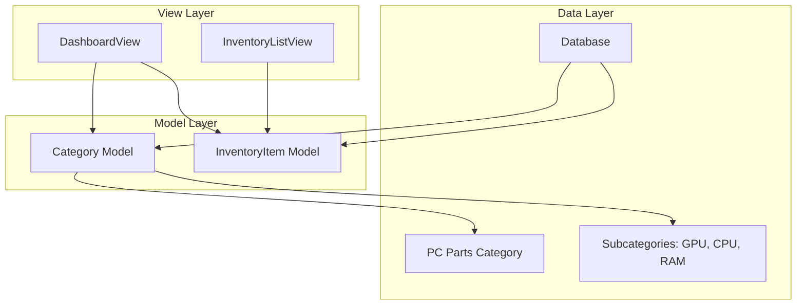

# Design Document: PC Parts Category Feature

## Overview

This document outlines the technical implementation for the "PC Parts" category feature, which introduces a mandatory top-level category for organizing computer hardware inventory items. The feature will automatically create the "PC Parts" category during database initialization and modify the dashboard to display items from this category instead of general recent inventory items.

### Feature Goals

1. Create a mandatory top-level "PC Parts" category automatically during database setup
2. Display items from the "PC Parts" category on the dashboard
3. Show items with subcategory prefix format: "Subcategory: Item Name"

## Architecture

### Current Architecture

The Inventory Management System follows a Django MVC architecture:

```
Inventory Management System
├── authentication/       # User authentication and dashboard
├── categories/           # Category management (hierarchical)
├── inventory/            # Inventory item CRUD operations
├── sales/                # Sales processing
└── inventory_management/ # Project settings and routing
```

### Architecture Changes

This feature requires minimal architecture changes as the existing category and inventory systems already support the required functionality. The changes will be:

1. **Migration Layer**: Add a data migration to create the "PC Parts" category
2. **Dashboard View**: Modify to filter items by the "PC Parts" category
3. **Template Layer**: Update dashboard template for new display format

### Component Interactions



## Components and Interfaces

### Components to Modify

#### 1. Database Migration Component

**Location**: `categories/migrations/0003_create_pc_parts_category.py`

**Purpose**: Create the "PC Parts" category during migration execution

**Key Functions**:
- `create_pc_parts_category`: Create the mandatory category if it doesn't exist

#### 2. Dashboard View Component

**Location**: `authentication/views.py`

**Current**: `DashboardView`

**Modifications**:
- Filter inventory items to only show those in the "PC Parts" category
- Calculate statistics for PC Parts items

#### 3. Dashboard Template Component

**Location**: `templates/dashboard.html`

**Modifications**:
- Update section title from "Recent Inventory Items" to "PC Parts Items"
- Update item display format to include subcategory prefix
- Update message when no items exist

## Data Models

### Current Data Models

#### Category Model (`categories/models.py`)

```python
class Category(models.Model):
    name = models.CharField(max_length=100)
    description = models.TextField(blank=True)
    parent = models.ForeignKey('self', null=True, blank=True, ...)
    is_active = models.BooleanField(default=True)
    created_at = models.DateTimeField(auto_now_add=True)
    updated_at = models.DateTimeField(auto_now=True)
    deleted_at = models.DateTimeField(null=True, blank=True)
```

**Key Fields**:
- `name`: Category name (unique per parent)
- `parent`: Reference to parent category (null for root)
- `is_active`: Soft-delete flag
- `deleted_at`: Soft-delete timestamp

#### InventoryItem Model (`inventory/models.py`)

```python
class InventoryItem(models.Model):
    user = models.ForeignKey(settings.AUTH_USER_MODEL, ...)
    category = models.ForeignKey('categories.Category', ...)
    name = models.CharField(max_length=200)
    description = models.TextField(blank=True)
    purchase_date = models.DateField()
    purchase_price = models.DecimalField(max_digits=10, decimal_places=2)
    characteristics = models.JSONField(default=dict, blank=True)
    status = models.CharField(max_length=20, choices=STATUS_CHOICES)
    deleted_at = models.DateTimeField(null=True, blank=True)
```

**Key Fields**:
- `category`: Foreign key to Category model
- `status`: Current item status (available, in_repair, sold, scrapped)
- `deleted_at`: Soft-delete timestamp

### Data Model Changes

No schema changes are required. The existing Category and InventoryItem models already support hierarchical categories and filtering by category.

## Correctness Properties

*A property is a characteristic or behavior that should hold true across all valid executions of a system-essentially, a formal statement about what the system should do. Properties serve as the bridge between human-readable specifications and machine-verifiable correctness guarantees.*

### Property 1: PC Parts category creation is idempotent

*For any* database state, running the migration to create the "PC Parts" category should not create duplicate categories. If the category exists, no new category should be created.

**Validates: Requirements 1.1, 1.2, 1.5**

### Property 2: Dashboard displays items from PC Parts category

*For any* user with inventory items in the "PC Parts" category (including subcategories), the dashboard should display only those items, not items from other categories.

**Validates: Requirements 3.1, 3.3**

### Property 3: Subcategory prefix display format

*For any* inventory item displayed on the dashboard that belongs to a subcategory of "PC Parts", the display should include the immediate subcategory name followed by a colon and the item name. Items directly under "PC Parts" (root level) should display only the item name.

**Validates: Requirements 4.1, 4.2, 4.3**

### Property 5: Subcategory path displays immediate parent only

*For any* inventory item whose category is nested under "PC Parts" (at any level), the display should show only the immediate subcategory name, not the full category path.

**Validates: Requirements 4.4**

### Property 6: Soft-delete handling

*For any* item or category that is soft-deleted, it should not appear in normal dashboard queries or category listings.

**Validates: Requirements 5.2**

## Error Handling

### Migration Errors

**Error**: Category creation fails due to database constraint violation

**Handling**: 
- Migration will fail with a clear error message
- Category with same name already exists under different parent
- Solution: Manual database cleanup required

**Error**: Migration fails during category creation

**Handling**:
- Django migration system will mark migration as failed
- Database transaction is rolled back
- User can retry migration after fixing underlying issue

### Dashboard View Errors

**Error**: "PC Parts" category not found

**Handling**:
- Dashboard view should handle missing category gracefully
- Display appropriate message: "No PC Parts category found"
- Consider logging a warning for administrators

**Error**: Category query fails

**Handling**:
- Catch exceptions and display user-friendly error
- Log detailed error for debugging
- Return empty item list rather than crashing

### Template Rendering Errors

**Error**: Subcategory name retrieval fails

**Handling**:
- Use template default filter: `{{ category.parent.name|default:"PC Parts" }}`
- Display fallback message if subcategory cannot be determined

## Testing Strategy

### Dual Testing Approach

**Unit Tests**: Verify specific examples, edge cases, and error conditions  
**Property Tests**: Verify universal properties across all inputs  
**Integration Tests**: Verify end-to-end functionality and data consistency

### Unit Testing

Unit tests should focus on:
- Specific examples that demonstrate correct behavior
- Integration points between components
- Edge cases and error conditions

#### Test Cases for Migration

1. **Migration creates PC Parts category when it doesn't exist**
   - Given: Database with no "PC Parts" category
   - When: Migration `0003_create_pc_parts_category` is run
   - Then: "PC Parts" category is created with `is_active=True`

2. **Migration does not create duplicate category**
   - Given: Database with existing "PC Parts" category
   - When: Migration is run
   - Then: No new category is created

3. **Migration handles concurrent execution safely**
   - Given: Multiple migration processes attempt to create category simultaneously
   - When: Migration runs
   - Then: Only one category is created (database constraint handles this)

#### Test Cases for Dashboard View

1. **Dashboard shows items from PC Parts category only**
   - Given: User has items in multiple categories
   - When: Dashboard is loaded
   - Then: Only items from PC Parts category (including subcategories) are displayed

2. **Dashboard handles missing PC Parts category gracefully**
   - Given: Database without "PC Parts" category
   - When: Dashboard is loaded
   - Then: Empty list or appropriate message is shown

3. **Dashboard shows correct item count and stats**
   - Given: User has X items in PC Parts category
   - When: Dashboard is loaded
   - Then: Stats reflect only PC Parts items

#### Test Cases for Display Format

1. **Items with subcategory show "Subcategory: Name" format**
   - Given: Item with subcategory "GPU" and name "RTX 2060"
   - When: Item is displayed on dashboard
   - Then: Display text is "GPU: RTX 2060"

2. **Items directly under PC Parts show only name**
   - Given: Item with category "PC Parts" (no parent) and name "Motherboard"
   - When: Item is displayed on dashboard
   - Then: Display text is "Motherboard"

3. **Nested subcategories show immediate parent**
   - Given: Item with category "SSD" (child of "PC Parts") and name "1TB NVMe"
   - When: Item is displayed on dashboard
   - Then: Display text is "SSD: 1TB NVMe"

### Property-Based Testing

**Minimum 100 iterations per property test**

#### Property 1: Idempotent category creation

```python
# Feature: pc-parts-category, Property 1: PC Parts category creation is idempotent

def test_category_creation_idempotent():
    """Running migration multiple times should not create duplicates."""
    # Generate random database states
    # Run migration on each state
    # Verify exactly one "PC Parts" category exists
```

#### Property 2: Dashboard filters correctly

```python
# Feature: pc-parts-category, Property 2: Dashboard displays items from PC Parts category

def test_dashboard_filters_pc_parts():
    """Dashboard should only show items from PC Parts category."""
    # Generate random user with items in various categories
    # Run dashboard view
    # Verify only PC Parts items are returned
```

#### Property 3: Display format correctness

```python
# Feature: pc-parts-category, Property 3: Subcategory prefix display format

def test_display_format():
    """Items should display with subcategory prefix when applicable."""
    # Generate random items with various category structures
    # Run display format logic
    # Verify format matches requirements
```

### Integration Testing

Integration tests should verify end-to-end functionality:

1. **Complete workflow: migration → category creation → dashboard display**
   - Run migrations
   - Create test user
   - Create items in PC Parts category
   - Verify dashboard displays correctly

2. **Soft-delete behavior**
   - Create items in PC Parts category
   - Soft-delete items
   - Verify items don't appear on dashboard

3. **Concurrent access**
   - Multiple users access dashboard simultaneously
   - Verify each user sees their own PC Parts items

### Test Configuration

- Property-based tests: Minimum 100 iterations per property
- Unit tests: Target 80%+ code coverage
- Integration tests: Run on CI/CD pipeline

## Implementation Steps

### Phase 1: Create Migration (Categories App)

1. Create new migration file: `categories/migrations/0003_create_pc_parts_category.py`
2. Implement data migration to create "PC Parts" category
3. Handle idempotency (check if category exists before creating)
4. Set `is_active=True` and `parent=None` (root category)

### Phase 2: Modify Dashboard View (Authentication App)

1. Update `DashboardView.get_context_data()`
2. Add logic to find "PC Parts" category
3. Filter inventory items by PC Parts category (including subcategories)
4. Calculate statistics for PC Parts items only
5. Add items to context with display format

### Phase 3: Update Dashboard Template

1. Update section title to "PC Parts Items"
2. Modify item display loop to show "Subcategory: Name" format
3. Update empty state message to reflect PC Parts
4. Update tip message to mention PC Parts organization

### Phase 4: Testing

1. Write unit tests for migration
2. Write unit tests for dashboard view modifications
3. Write integration tests for complete workflow
4. Write property-based tests for key properties

## Migration Strategy

### Migration File Structure

```python
# categories/migrations/0003_create_pc_parts_category.py
from django.db import migrations

def create_pc_parts_category(apps, schema_editor):
    """Create PC Parts category if it doesn't exist."""
    Category = apps.get_model('categories', 'Category')
    
    # Check if category already exists
    existing = Category.objects.filter(
        name='PC Parts',
        parent__isnull=True  # Root category
    )
    
    if not existing.exists():
        Category.objects.create(
            name='PC Parts',
            description='Top-level category for PC hardware inventory',
            is_active=True
        )

class Migration(migrations.Migration):
    dependencies = [
        ('categories', '0002_category_deleted_at_category_is_active'),
    ]
    
    operations = [
        migrations.RunPython(create_pc_parts_category),
    ]
```

### Migration Execution

1. Add migration to categories app
2. Run `python manage.py makemigrations categories`
3. Run `python manage.py migrate`
4. Verify "PC Parts" category exists in database

## Additional Considerations

### Performance

- Category lookup: Use database indexes on `name` and `parent` fields
- Dashboard query: Filter by category ID rather than name to avoid lookups
- Consider caching the "PC Parts" category ID if performance is critical

### Security

- Category name uniqueness is enforced by database constraint
- Soft-delete prevents data loss while hiding items
- User-specific filtering ensures users only see their own items

### Future Enhancements

1. Add CLI command to verify/create "PC Parts" category
2. Add admin action to create common subcategories (GPU, CPU, RAM, etc.)
3. Add migration versioning for future category changes
4. Consider signals to prevent deletion of "PC Parts" category

## Success Criteria

1. ✅ Migration creates "PC Parts" category automatically
2. ✅ Category is idempotent (safe to run multiple times)
3. ✅ Dashboard displays only PC Parts items
4. ✅ Display format shows "Subcategory: Item Name"
5. ✅ Items not in PC Parts category are hidden from dashboard
6. ✅ No database schema changes required
7. ✅ All tests pass (unit, integration, property-based)
### Property 5: Nested category display uses immediate parent

```python
# Feature: pc-parts-category, Property 4: Subcategory path displays immediate parent only

def test_nested_category_display():
    """Nested categories should only display immediate parent name."""
    # Generate random items with various nesting levels
    # Verify only immediate parent name appears in display
```